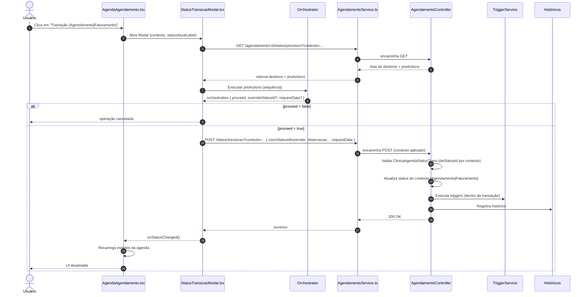

# Transições de Status com Contexto, preActions e Orchestrator

> Documento unificado das implementações de FSM (máquina de estados) do agendamento, com suporte a contexto (Agendamento | Faturamento), preActions (data-driven), Orchestrator no frontend e endpoints/serviços atualizados.

## 1. Conceitos-Chave

- **Contexto de Transição**
  - AGENDAMENTO: usa e atualiza `statusAgendamentoId`
  - FATURAMENTO: usa e atualiza `statusFaturamentoId`
- **preActions (data-driven)**
  - Metadados por transição vindos do backend (ordem, type, modal, size, params, overrideStatusId)
  - Executadas no frontend via Orchestrator antes do POST de transição
- **Orchestrator (frontend)**
  - Centraliza execução de preActions (abre modais, coleta dados, valida)
  - Permite `overrideStatusId` e agrega `requestData` para o POST final

## 2. Endpoints (Backend)

- GET Próximos Status (com contexto)
  - `GET /api/clinica/agendamento/:agendamentoId/status/proximos?contexto=AGENDAMENTO|FATURAMENTO`
  - Seleciona `fromStatusId` com base no contexto
  - Inclui `preActions` para ambos os contextos

- POST Transição de Status (com contexto)
  - `POST /api/clinica/agendamento/:agendamentoId/status/transicao?contexto=AGENDAMENTO|FATURAMENTO`
  - Valida transição em `ClinicaAgendaStatusTrans` com `deStatusId = fromStatusId`
  - Atualiza o campo correspondente (agendamento/faturamento)
  - Executa `StatusTransitionTriggerService.executeTriggers` em todos os contextos
  - Registra histórico em `ClinicaAgendaStatusHistorico`

## 3. Backend – Pontos de Integração

- Controller: `server/src/controller/clinica/agendamentoController.ts`
  - `getNextPossibleStatus(req)`: lê `req.query.contexto`, calcula `fromStatusId` e retorna destinos com `preActions`
  - `changeStatus(req)`: lê `req.query.contexto`, valida `ClinicaAgendaStatusTrans`, atualiza status correto, executa triggers e grava histórico

- Associações: `server/src/database/models/clinica/clinicaAssociations.ts`
  - `ClinicaAgendamento.belongsTo(ClinicaAgendaStatus, { as: 'statusAgendamento' })`
  - `ClinicaAgendamento.belongsTo(ClinicaAgendaStatus, { as: 'statusFaturamento' })`

- Observação (findById): usar aliases no include para evitar EagerLoadingError
  - `as: 'statusAgendamento'` e `as: 'statusFaturamento'`

## 4. Frontend – Serviços e Componentes

- Serviço: `front/src/services/clinica/AgendamentoService.ts`
  - `getNextPossibleStatus(agendamentoId, contexto?)` → envia `?contexto` na query
  - `changeStatus(agendamentoId, data, contexto?)` → envia `?contexto` na query

- Modal: `front/src/components/modals/clinica/StatusTransicaoModal.tsx`
  - Props: `agendamentoId`, `statusAtual?`, `contexto?`, `onStatusChanged?`
  - Busca destinos: `getNextPossibleStatus(agendamentoId, contexto)`
  - Executa preActions: `StatusTransitionOrchestrator.runFromPreActions(...)` (sempre que houver)
  - POST de transição: `changeStatus(agendamentoId, request, contexto)`
  - UI: badge com o contexto (AGENDAMENTO | FATURAMENTO)

- Página: `front/src/pages/presentation/clinica/AgendaAgendamento.tsx`
  - Mantém estado `statusTransicaoContexto` e `statusAtualLabel`
  - Botões abrem o mesmo modal, setando o contexto e o label corretos

## 5. preActions – Contrato de Dados

Estrutura por status de destino (conforme retorno do GET):
```json
{
  "statusId": 4,
  "descricao": "Atendido",
  "categoria": "ATENDIMENTO",
  "cor": "#27ae60",
  "preActions": [
    {
      "type": "modal",
      "modal": "ObservacaoModal",
      "size": "md",
      "overrideStatusId": null,
      "params": { "placeholder": "Observações" }
    }
  ]
}
```

Regras:
- `preActions` executam em ordem (por `ordem`, se informado)
- `overrideStatusId` substitui o `novoStatusId` da transição
- `params` são passados para os modais/steps do Orchestrator

## 6. Triggers (StatusTransitionTriggerService)

- Execução após a atualização do status (na mesma transação)
- Executado em ambos os contextos
- Se um trigger falhar, a transição é revertida

## 7. Exemplo de Fluxo Completo

1. Usuário clica no botão de transição (Agendamento ou Faturamento)
2. Modal abre com badge do contexto e status atual
3. Front chama `GET /status/proximos?contexto=...` e recebe destinos + `preActions`
4. Front executa `preActions` em cadeia via Orchestrator
5. Orchestrator devolve `requestData` e possível `overrideStatusId`
6. Front envia `POST /status/transicao?contexto=...` com `{ novoStatusId, observacao, ...requestData }`
7. Backend valida, atualiza status, executa triggers e registra histórico
8. UI atualiza e notifica sucesso

## 8. Boas Práticas

- Manter `ClinicaAgendaStatusTrans` enxuta e clara por contexto (status PRE/ATENDIMENTO/FINANCEIRO)
- Garantir que `preActions` sejam idempotentes e rápidas (evitar travar a transição)
- Logar o contexto em auditorias e monitoramento
- Padronizar nomes de modais e tipos de `preActions`

## 9. Próximos Passos

- Parametrizar `preActions` financeiras específicas por convênio/guia
- Observabilidade: logs estruturados por transição (empresaId, agendamentoId, contexto, de→para)
- Testes E2E cobrindo os dois contextos

## 10. Diagramas

### 10.1 Sequência ponta-a-ponta (com contexto e preActions)



### 10.2 Fluxo de decisão no backend (contexto)

```mermaid
flowchart TD
  A[Recebe requisição] --> B{Endpoint}
  B -->|GET /status/proximos| C[Extrai contexto: AGENDAMENTO|FATURAMENTO]
  B -->|POST /status/transicao| D[Extrai contexto]

  C --> E[Carrega agendamento]
  D --> F[Carrega agendamento]

  E --> G{Contexto}
  F --> H{Contexto}

  G -->|AGENDAMENTO| I[fromStatusId = statusAgendamentoId]
  G -->|FATURAMENTO| J[fromStatusId = statusFaturamentoId]
  H -->|AGENDAMENTO| K[fromStatusId = statusAgendamentoId]
  H -->|FATURAMENTO| L[fromStatusId = statusFaturamentoId]

  I --> M[Consulta ClinicaAgendaStatusTrans de=from]
  J --> M
  M --> N[Inclui preActions no payload]
  N --> O[Retorna destinos + preActions]

  K --> P[Valida ClinicaAgendaStatusTrans de=from]
  L --> P
  P --> Q{Permitida?}
  Q -->|Não| R[400 Validation Error]
  Q -->|Sim| S[Atualiza status do contexto]
  S --> T[Executa TriggerService (dentro da transação)]
  T --> U[Registra Histórico]
  U --> V[200 OK]
```
