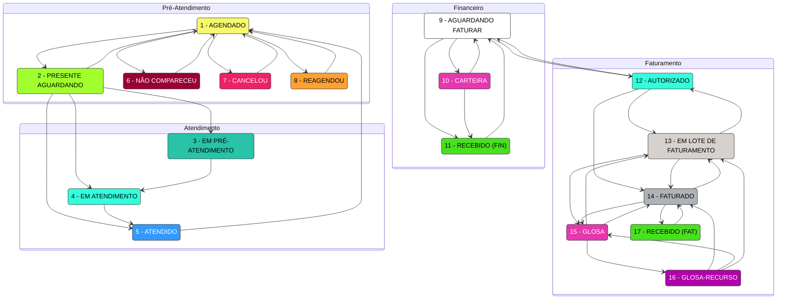

# Clínica - Fluxos de Status de Agendamento

Este diagrama representa a máquina de estados (FSM) dos agendamentos, com as transições permitidas conforme os seeders:
- `server/src/database/seeders/20250625-02-clinica-agenda-status-Default.ts`
- `server/src/database/seeders/20250625-03-clinica-agenda-status-trans-Default.ts`

Os nós estão agrupados por categoria e coloridos conforme a cor definida em cada status.

## Observações
- As cores dos nós correspondem ao campo `cor` de cada status no seeder `20250625-02-clinica-agenda-status-Default.ts`.
- Como há dois status com descrição "RECEBIDO" (11 e 17), foram rotulados como `RECEBIDO (FIN)` e `RECEBIDO (FAT)` para desambiguar as categorias.
- Este diagrama utiliza `stateDiagram-v2` do Mermaid, adequado para modelar máquinas de estados finitos.
