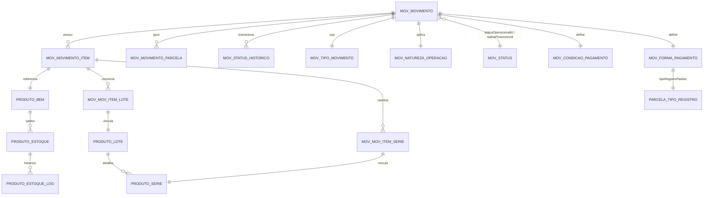
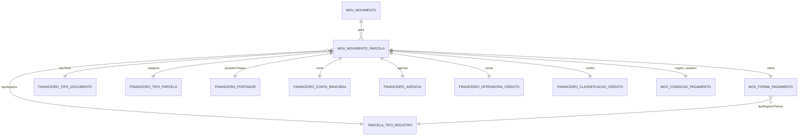
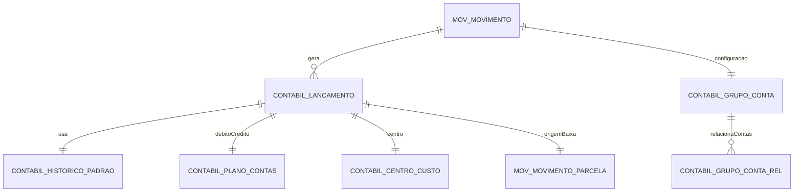
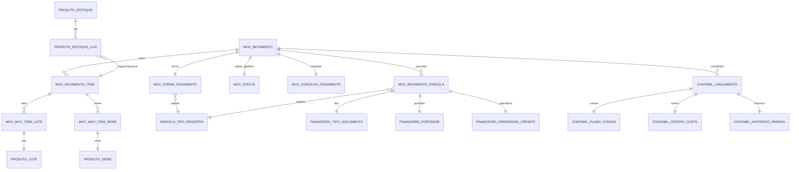

# Diagramas Mermaid – Módulo Movimento / Financeiro / Contábil

Documentação visual das entidades principais, dividida por domínio e com uma visão consolidada.

## 1. Movimento (Operacional + Estoque)

**Notas**
1. `statusOperacionalId` e `statusFinanceiroId` apontam para `mov_status`, permitindo múltiplos pipelines.
2. `mov_movimento_item_lote` e `mov_movimento_item_serie` garantem rastreabilidade farmacêutica (lotes, validade, séries).
3. `produto_estoque_log` audita todo impacto de estoque, associado opcionalmente ao movimento/item.

## 2. Financeiro (Parcelas, Bancos, Cheques, Cartões)

**Notas**
1. `ParcelaTipoRegistro` garante consistência entre backend e frontend.
2. `mov_forma_pagamento.tipoRegistroPadrao` define automaticamente o registro financeiro ao gerar parcelas.
3. Estrutura preparada para cheques (situação, portador), cartões (operadora) e créditos (cliente/fornecedor).

## 3. Contábil (Integração)

**Notas**
1. A natureza do movimento define regras para gerar lançamentos (débitos/créditos, centro de custo, histórico padrão).
2. Parcelas quitadas podem gerar lançamentos complementares (baixa financeira).

## 4. Visão Consolidada (Movimento + Financeiro + Contábil)

**Notas Finais**
- Diagramas seguem uma visão lógica; nomes condensados em MAIÚSCULO indicam tabelas ou modelos Sequelize.
- Ajuste conforme evoluções futuras (p. ex. inclusão de `statusEstoqueId` ou serviços externos).
