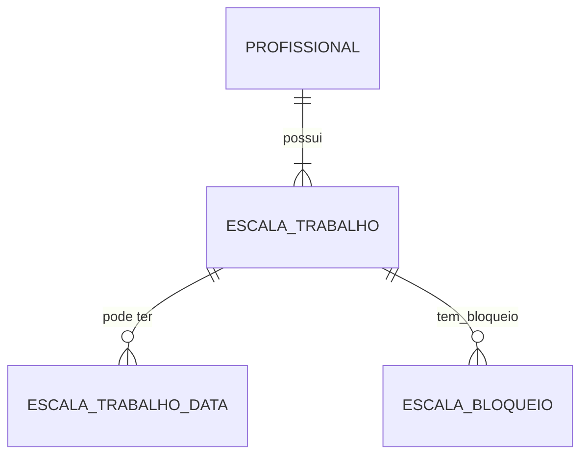
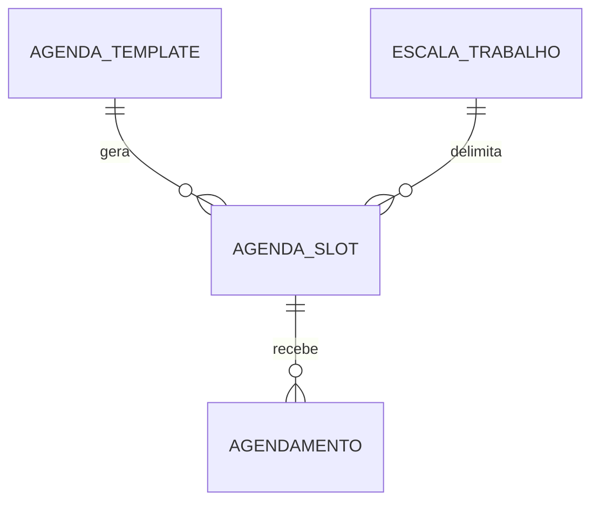

# Instruções de Modelagem – Módulo de Agenda

> Este documento descreve o modelo conceitual (DER), entidades físicas, exemplos de configuração e regras de negócio para suportar os diferentes tipos de agenda adotados pela clínica.

## 1. Visão Geral
O sistema deve permitir múltiplos **tipos de agenda** coexistirem na mesma base. Cada profissional pode adotar um tipo diferente, parametrizado por um _template_ de agenda.

Tipos contemplados:

| ID | Código (enum) | Nome de Exibição                | Descrição Sintética                                   |
|----|---------------|---------------------------------|-------------------------------------------------------|
| 1  | FIXA          | Agenda Fixa (Horário Marcado)   | Slots de tempo exatos (15 min, 30 min…)               |
| 2  | ORDEM_CHEGADA | Agenda por Ordem de Chegada     | Todos marcam 07:00 e são atendidos pela senha         |
| 3  | BLOCO         | Agenda por Blocos               | Intervalos com capacidade definida                    |
| 4  | MULTI         | Agenda Multi-Slot               | Permite múltiplos agendamentos (N) no mesmo slot (capacidade variável) |
| 5  | MISTA         | Agenda Mista                    | Combina FIXA + BLOCO ou ORDEM_CHEGADA                 |
| 6  | DEMANDA       | Demanda Espontânea (Triagem)    | Walk-in, atendimento pela prioridade da triagem       |
| 7  | TELECONSULTA  | Teleconsulta Programada         | Slots reservados exclusivamente para teleconsulta     |

### 1.1 Escala de Trabalho (Jornada)
A **Escala de Trabalho** define *quando* o profissional está disponível, independente do *como* ocorrem os agendamentos (tipo de agenda).  
Ela pode ser reutilizada por diferentes `AGENDA_TEMPLATE` do mesmo profissional.

**Tipos de escala** (campo `tipo`):

| Tipo          | Descrição                                                           | Campos relevantes |
|---------------|---------------------------------------------------------------------|-------------------|
| SEMANAL       | Padrão semanal (ex.: seg-sex 08-18).                                | `dias_semana`, `hora_inicio`, `hora_fim` |
| ESPECIFICA    | Datas pontuais que fogem ao padrão (ex.: 13/07/2025 08-12).         | tabela `ESCALA_TRABALHO_DATA` |

#### Estrutura sugerida


```text
ESCALA_TRABALHO
  id PK
  profissional_id FK
  template_id FK nullable
  tipo ENUM('SEMANAL','ESPECIFICA')
  hora_inicio time
  hora_fim time
  dias_semana string nullable  // '1,3,5' se SEMANAL

ESCALA_TRABALHO_DATA
  id PK
  escala_id FK
  data date
  hora_inicio time
  hora_fim time

ESCALA_BLOQUEIO
  id PK
  escala_id FK
  hora_inicio time
  hora_fim time
  descricao string nullable
```

#### Exemplos práticos por tipo de agenda

1. **FIXA – Dr. A** (semana cheia)
```json
{
  "tipoAgenda": "FIXA",
  "templateId": "uuid-template-fixa",
  "escala": {
    "tipo": "SEMANAL",
    "dias_semana": "1,2,3,4,5",
    "hora_inicio": "08:00",
    "hora_fim": "18:00"
  }
}
```

2. **ORDEM_CHEGADA – Dr. B** (seg, qua, sex manhã)
```json
{
  "tipoAgenda": "ORDEM_CHEGADA",
  "templateId": "uuid-template-oc",
  "escala": {
    "tipo": "SEMANAL",
    "dias_semana": "1,3,5",
    "hora_inicio": "08:00",
    "hora_fim": "12:00"
  }
}
```

3. **BLOCO – Dr. C** (dias específicos)
```json
{
  "tipoAgenda": "BLOCO",
  "templateId": "uuid-template-bloco",
  "escala": {
    "tipo": "ESPECIFICA",
    "datas": [
      { "data": "2025-07-13", "hora_inicio": "08:00", "hora_fim": "12:00" },
      { "data": "2025-07-25", "hora_inicio": "13:00", "hora_fim": "18:00" }
    ]
  }
}
```

4. **MULTI – Dr. D** (seg-sex tarde, exceto feriados)
```json
{
  "tipoAgenda": "MULTI",
  "templateId": "uuid-template-multi",
  "escala": {
    "tipo": "SEMANAL",
    "dias_semana": "1,2,3,4,5",
    "hora_inicio": "13:00",
    "hora_fim": "17:00"
  }
}
```

> Observação: quando `ESCALA_TRABALHO.template_id` é **null**, a escala é considerada *genérica* para todos os templates do profissional. Caso contrário, aplica-se apenas ao template indicado.


## 2. DER (Diagrama Entidade-Relacionamento)

```mermaid
erDiagram
    PROFISSIONAL ||..|| ESPECIALIDADE : possui
    PROFISSIONAL ||--o{ ESCALA_TRABALHO : "tem"
    ESCALA_TRABALHO ||--o{ ESCALA_TRABALHO_DATA : "datas"
    ESCALA_TRABALHO ||--o{ ESCALA_BLOQUEIO : "bloqueios"
    PROFISSIONAL ||--o{ AGENDA_TEMPLATE : "usa"
    ESCALA_TRABALHO ||--o{ AGENDA_TEMPLATE : "delimita"
    PACIENTE ||--o{ AGENDAMENTO : "possui"
    AGENDA_TEMPLATE ||--|{ SLOT_CONFIG : "define"
    SLOT_CONFIG ||--o{ AGENDAMENTO : "gera"
    AGENDAMENTO }o--|| TIPO_AGENDA : "é"
    AGENDAMENTO }o--|| SENHA : "pode gerar"
    AGENDAMENTO }o--|| TRIAGEM : "pode ter"

    TIPO_AGENDA {
        string codigo PK
        string nome
        string descricao
    }
    PROFISSIONAL {
        int   id PK
        string nome
        string crm
    }
    PACIENTE {
        int   id PK
        string nome
        date   dt_nascimento
        string telefone
    }
    AGENDA_TEMPLATE {
        int   id PK
        int   profissional_id FK
        string tipo_agenda_codigo FK
        int    escala_id FK nullable
        int    duracao_slot_minutos nullable
        int    capacidade_bloco nullable
        int    capacidade_slot nullable   // suporta MULTI
        bool   permitir_encaixe default false
    }
    SLOT_CONFIG {
        int   id PK
        int   template_id FK
        time   inicio
        time   fim
        int    capacidade
    }
    AGENDAMENTO {
        int   id PK
        int   paciente_id FK
        int   slot_config_id FK nullable
        date   data
        time   hora_prevista nullable
        int    ordem_chegada nullable
        int    prioridade nullable
        enum   status (AGENDADO, ATENDIDO, AUSENTE, CANCELADO)
    }
    SENHA {
        int   id PK
        int   agendamento_id FK
        int    numero
        timestamp dt_emissao
    }
    TRIAGEM {
        int   id PK
        int   agendamento_id FK
        int    prioridade
        string observacao
    }
```

### 2.1 Relacionamentos-chave
1. **AGENDA_TEMPLATE → TIPO_AGENDA**: indica qual lógica de agendamento será aplicada.
2. **SLOT_CONFIG** existe apenas para os tipos que usam blocos ou horários fixos (FIXA, BLOCO, DUPLO, TELECONSULTA).
3. **AGENDAMENTO.ordem_chegada** é preenchido automaticamente nos tipos ORDEM_CHEGADA ou DEMANDA.
4. **TRIAGEM** aparece apenas em DEMANDA, contendo a prioridade clínica.

## 3. Exemplos de Configuração por Tipo

### 3.1 FIXA (Horário Marcado)
```json
{
  "tipoAgenda": "FIXA",
  "profissionalId": "uuid-medico-1",
  "escalaId": "uuid-escala-1",
  "duracaoSlotMinutos": 20
}
```
*Resultado*: Slots gerados 08:00-11:40, pausa 12:00-13:29, retomando 13:30-17:40.

### 3.2 ORDEM_CHEGADA (Senha Única)
```json
{
  "tipoAgenda": "ORDEM_CHEGADA",
  "profissionalId": "uuid-medico-2",
  "horaInicio": "07:00",
  "horaFim": "11:00"
}
```
*Resultado*: Todos os pacientes veem o horário 07:00 no aplicativo. Ao chegar, recebem `senha.numero` incremental.

### 3.3 BLOCO (Capacidade por Faixa)
```json
{
  "tipoAgenda": "BLOCO",
  "profissionalId": "uuid-medico-3",
  "slotConfig": [
    { "inicio": "07:00", "fim": "08:59", "capacidade": 5 },
    { "inicio": "09:00", "fim": "10:59", "capacidade": 6 },
    { "inicio": "11:00", "fim": "11:59", "capacidade": 3 }
  ]
}
```
*Resultado*: Paciente escolhe o bloco; não há hora exata, apenas número dentro da capacidade.

### 3.4 MULTI (Capacidade por Slot)
```json
{
  "tipoAgenda": "MULTI",
  "profissionalId": "uuid-medico-1",
  "horaInicio": "13:00",
  "horaFim": "16:00",
  "duracaoSlotMinutos": 30,
  "capacidadeSlot": 4
}
```

### 3.5 DEMANDA (Triagem / Livre Demanda)
```json
{
  "tipoAgenda": "DEMANDA",
  "profissionalId": "uuid-pronto-socorro",
  "horaInicio": "07:00",
  "horaFim": "19:00",
  "usaTriagem": true
}
```
*Fluxo*: Paciente chega → recebe ficha → enfermeiro registra prioridade (verde, amarelo, vermelho) → fila é reordenada.

### 3.6 MISTA
Combine dois templates para o mesmo profissional (ex.: manhã FIXA, tarde ORDEM_CHEGADA).

### 3.7 TELECONSULTA
Idêntico à FIXA, porém com flag `isTeleconsulta` e validações de reunião online.

## 4. Regras de Negócio Essenciais
1. **Conflito**: Não permitir sobreposição de slots para o mesmo profissional e data.
2. **Capacidade**: BLOCO e MULTI devem validar `capacidade` antes de confirmar agendamento.
3. **Dias da Semana**: Armazenados como string no formato '0,1,2,3,4,5,6' onde 0=domingo, 1=segunda, etc.
4. **Ordem de Atendimento**:
   - ORDEM_CHEGADA: `ordem_chegada` crescente.
   - DEMANDA: `prioridade` (triagem) desc, depois `ordem_chegada`.
5. **No-show**: após X minutos de atraso, marcar como AUSENTE e liberar slot.
6. **Encaixes**: se `permitir_encaixe` for verdadeiro, permitir criação manual além da capacidade com destaque de cor.
7. **Datas Específicas**: Agendas do tipo ORDEM_CHEGADA (ID 2) podem ter datas específicas configuradas.

## 5. Considerações para Implementação (Sequelize)
- Criar enums no banco (`TIPO_AGENDA`) ou tabela de referência (mostrado no DER).
- Usar **scopes** para filtrar agendamentos por status.
- Agendamentos podem ser migrados entre slots (drag-and-drop) respeitando regras de conflito.
- O campo `diasSemana` foi migrado de formato JSON para STRING(20) para facilitar consultas SQL e indexação.
- Interfaces TypeScript compartilhadas entre backend e frontend na pasta `/shared/interfaces/clinica/agendaTemplate.ts`.

### 5.1 Modelo `AGENDA_SLOT`
Cada *slot* representa um intervalo de tempo **gerado** a partir de um `AGENDA_TEMPLATE` **dentro** da janela da `ESCALA_TRABALHO`.



```text
AGENDA_SLOT
  id PK
  template_id FK                 // de qual template nasceu
  escala_id FK nullable          // escala usada (caso vinculado)
  data date                      // dia do slot
  hora_inicio time
  hora_fim time
  capacidade int default 1       // FIXA = 1, BLOCO/MULTI variam
  ocupacao int default 0         // qtd agendamentos confirmados
  status ENUM('ABERTO','BLOQUEADO','LOTADO','CANCELADO') default 'ABERTO'
  
  created_at timestamp
  updated_at timestamp
```

Regras:
1. `ocupacao` é atualizado por gatilhos após INSERT/DELETE em `AGENDAMENTO`.
2. Quando `ocupacao >= capacidade`, `status` muda para **LOTADO**.
3. Bloqueios gerados a partir de `ESCALA_BLOQUEIO` criam slots com `status=BLOQUEADO` e `capacidade=0`.
4. Para tipos ORDEM_CHEGADA e DEMANDA, todos os pacientes reservam o **mesmo** slot (07:00) e são diferenciados por senha/triagem.

Exemplo de slot BLOCO:
```json
{
  "id": 987,
  "templateId": "uuid-template-bloco",
  "data": "2025-07-18",
  "horaInicio": "09:00",
  "horaFim": "10:59",
  "capacidade": 6,
  "ocupacao": 4,
  "status": "ABERTO"
}
```

## 6. Implementação Atual
1. **Backend**: Implementado com Sequelize e Node.js.
   - Modelos: `AgendaTemplate`, `AgendaTemplateDatas`, `AgendaStatus`, `AgendaStatusTrans`
   - Controllers: `agendaController`, `agendaDataController`, `agendaStatusController`
   - Rotas: `/api/clinica/agenda`, `/api/clinica/agenda-data`, `/api/clinica/agenda-status`

2. **Frontend**: Implementado com React, TypeScript e Vite.
   - Serviços: `AgendaService`, `AgendaDataService`, `AgendaTipoService`, `agendaStatusService`
   - Componentes: `AgendaEditPage`, `AgendaListPage`, `AgendaDataManager`
   - Interfaces compartilhadas: `/shared/interfaces/clinica/agendaTemplate.ts`

3. **Próximos Passos**:
   - Implementar testes automatizados para validar regras de negócio
   - Melhorar UX para seleção de datas específicas
   - Implementar relatórios de ocupação de agenda

## 7. Segmentação por Procedimento / Convênio
Para restringir ou permitir exceções de agendamento conforme **procedimento** (ex.: Consulta, Exame, Cirurgia) ou **convênio médico** (ex.: Unimed, Particular), introduzimos a tabela `AGENDA_SEGMENTO`.

### 7.1 DER (extensão)
```mermaid
erDiagram
    AGENDA_TEMPLATE ||--o{ AGENDA_SEGMENTO : "possui"
    PROCEDIMENTO ||--o{ AGENDA_SEGMENTO : "referência"
    CONVENIO ||--o{ AGENDA_SEGMENTO : "referência"

    AGENDA_SEGMENTO {
        int   id PK
        int   template_id FK
        int   procedimento_id FK nullable
        int   convenio_id FK nullable
        enum  tipo (INCLUIR, EXCLUIR)
        int   idade_min nullable
        int   idade_max nullable
        enum  genero (M, F, O) nullable
    }
```
*Regra*: cada registro especifica se aquele procedimento/convênio é **INCLUIR** (whitelist) ou **EXCLUIR** (blacklist) para o template. Campos `procedimento_id` e `convenio_id` são opcionais; pelo menos um deve ser informado.

### 7.2 Política de Avaliação
1. Se existir ao menos um segmento **INCLUIR**, somente itens incluídos serão válidos.
2. Após filtrar inclusões, aplicar segmentos **EXCLUIR** para bloquear exceções.
3. Caso não haja segmentos, agenda aceita qualquer procedimento/convênio.
4. Restrições de idade e gênero são avaliadas junto com os demais filtros: se informados, o paciente deve se enquadrar no intervalo de idade (`idade_min`/`idade_max`) e/ou gênero (`genero`).

### 7.3 Exemplos JSON

#### 7.3.1 Exemplo de Whitelist de Convênio
```json
{
  "templateId": "uuid-template-fixa",
  "segmentos": [
    { "tipo": "INCLUIR", "convenioId": "uuid-unimed" },
    { "tipo": "INCLUIR", "convenioId": "uuid-sulamerica" }
  ]
}
```
*Efeito*: apenas pacientes dos convênios Unimed e SulAmérica podem agendar.

#### 7.3.2 Blacklist de Procedimentos
```json
{
  "templateId": "uuid-template-bloco",
  "segmentos": [
    { "tipo": "EXCLUIR", "procedimentoId": "uuid-cirurgia-pequeno-porte" }
  ]
}
```
*Efeito*: qualquer procedimento é permitido, exceto "Cirurgia de Pequeno Porte".

#### 7.3.3 Restrição por Idade e Gênero
```json
{
  "templateId": "uuid-template-ped",
  "segmentos": [
    { "tipo": "INCLUIR", "idadeMax": 12 },  // Apenas crianças até 12 anos
    { "tipo": "INCLUIR", "genero": "F" },   // Apenas feminino
    { "tipo": "EXCLUIR", "idadeMin": 60 }   // Bloqueia idosos acima de 60
  ]
}
```
*Efeito*: só permite agendamento para crianças ou mulheres, nunca para idosos acima de 60 anos.

#### 7.3.4 Combinação
```json
{
  "templateId": "uuid-template-demanda",
  "segmentos": [
    { "tipo": "INCLUIR", "procedimentoId": "uuid-consulta" },
    { "tipo": "EXCLUIR", "convenioId": "uuid-particular" }
  ]
}
```
*Efeito*: só permite "Consulta" em Demanda, mas bloqueia pacientes particulares.

### 7.4 Validação no Backend (Pseudo)
```typescript
function podeAgendar(template, procedimentoId, convenioId) {
  const segs = findSegmentos(template.id);
  const inclusoes = segs.filter(s => s.tipo === 'INCLUIR');
  const exclusoes = segs.filter(s => s.tipo === 'EXCLUIR');

  if (inclusoes.length) {
    const permitido = inclusoes.some(s =>
      (s.procedimentoId && s.procedimentoId === procedimentoId) ||
      (s.convenioId && s.convenioId === convenioId)
    );
    if (!permitido) return false;
  }

  const bloqueado = exclusoes.some(s =>
    (s.procedimentoId && s.procedimentoId === procedimentoId) ||
    (s.convenioId && s.convenioId === convenioId)
  );
  return !bloqueado;
}
```

### 7.5 Segmentos por Período / Dia da Semana
Para cobrir cenários como “manhã só convênio X” ou regras diferentes por dia da semana, estenda `AGENDA_SEGMENTO` com:

```
slot_config_id  FK nullable  — liga o segmento a um bloco/slot específico
weekday         int nullable — 0=Dom, 1=Seg … 6=Sáb (se nulo vale para todos)
```
`AGENDA_SEGMENTO` passa a poder receber três níveis de escopo:
1. **Template inteiro** (`slot_config_id` nulo, `weekday` nulo)
2. **Dia específico** (`weekday` definido, `slot_config_id` nulo)
3. **Bloco/período** (`slot_config_id` definido)

#### Exemplo das regras solicitadas
```json
{
  "templateId": "uuid-template-misto",
  "segmentos": [
    { "tipo": "INCLUIR", "convenioId": "uuid-unimed", "weekday": 3, "slotConfigId": "uuid-bloco-manha-qua" },
    { "tipo": "INCLUIR", "convenioId": "uuid-bradesco", "weekday": 3, "slotConfigId": "uuid-bloco-tarde-qua" },

    { "tipo": "INCLUIR", "convenioId": "uuid-particular", "weekday": 1 },                 // Segunda: só particular
    { "tipo": "INCLUIR", "procedimentoId": "uuid-retorno",       "weekday": 2 },                 // Terça: só retorno
    { "tipo": "INCLUIR", "convenioId": "uuid-particular", "weekday": 4, "slotConfigId": "uuid-bloco-manha-qui" },
    { "tipo": "INCLUIR", "procedimentoId": "uuid-retorno",  "convenioId": "uuid-particular", "weekday": 4, "slotConfigId": "uuid-bloco-tarde-qui" },

    { "tipo": "INCLUIR", "weekday": 5 }                                                           // Sexta: todos convênios
  ]
}
```
*Interpretação*:
- Regras com **slotConfigId** restringem apenas ao período (manhã/tarde).
- Regras somente com **weekday** valem para todo o dia.
- Sexta-feira inclui todos porque não define convênio/procedimento.

A função `podeAgendar()` deve agora filtrar segmentos aplicáveis ao dia/slot do agendamento antes de avaliar inclusões/exclusões.


## 8. Ciclo de Vida do Agendamento (FSM)
A gestão de status será implementada como **Máquina de Estados Finita** usando Sequelize + eventos de domínio.

### 8.1 DER (extensão)
```mermaid
erDiagram
    AGENDAMENTO ||--|{ AGENDA_STATUS_HIST : "possui"
    AGENDA_STATUS ||--|{ AGENDA_STATUS_TRANS : "origem"
    AGENDA_STATUS ||--|{ AGENDA_STATUS_TRANS : "destino"

    AGENDA_STATUS {
        string codigo PK  "AGENDADO"
        string nome       "Agendado"
        string categoria  "ATENDIMENTO|FINANCEIRO|PRE"
        string cor        "#3498db"
        int    ordem
    }
    AGENDA_STATUS_TRANS {
        int   id PK
        string de_codigo FK
        string para_codigo FK
        string trigger  nullable  // nome do evento a disparar
    }
    AGENDA_STATUS_HIST {
        int   id PK
        int   agendamento_id FK
        string status_codigo FK
        timestamp dt_mudanca
        int   usuario_id
    }
```

### 8.2 Seed inicial de status
```sql
INSERT INTO clinica_agenda_status (statusId, empresaId, descricao, categoria, cor, ordem, stAtivo) VALUES
 (1, NULL, 'Agendado', 'PRE', '#2980b9', 1, true),
 (2, NULL, 'Presente / Aguardando', 'PRE', '#8e44ad', 2, true),
 (3, NULL, 'Em Dilatação', 'PRE', '#9b59b6', 3, true),
 (4, NULL, 'Atendido', 'ATENDIMENTO', '#27ae60', 4, true),
 (5, NULL, 'Não Compareceu', 'ATENDIMENTO', '#c0392b', 4, true),
 (6, NULL, 'Cancelado', 'PRE', '#7f8c8d', 4, true),
 (7, NULL, 'Pago', 'FINANCEIRO', '#f1c40f', 5, true),
 (8, NULL, 'Faturado', 'FINANCEIRO', '#e67e22', 6, true);
```

### 8.3 Exemplo de transições permitidas
```sql
INSERT INTO clinica_agenda_status_trans (transStatusId, empresaId, deStatusId, paraStatusId, trigger, stAtivo) VALUES
 (1, NULL, 1, 2, NULL, true), -- Agendado -> Presente
 (2, NULL, 1, 6, NULL, true), -- Agendado -> Cancelado
 (3, NULL, 1, 5, NULL, true), -- Agendado -> Não Compareceu
 (4, NULL, 2, 3, NULL, true), -- Presente -> Em Dilatação
 (5, NULL, 2, 4, NULL, true), -- Presente -> Atendido
 (6, NULL, 3, 4, NULL, true), -- Em Dilatação -> Atendido
 (7, NULL, 4, 7, NULL, true), -- Atendido -> Pago
 (8, NULL, 7, 8, NULL, true); -- Pago -> Faturado
```

### 8.4 Serviço de transição (Node/TS)
```ts
// agendaStatusService.ts
export async function changeStatus(agendamentoId: number, novoStatusId: number, userId: number) {
  return sequelize.transaction(async t => {
    const ag = await Agendamento.findByPk(agendamentoId, { transaction: t });
    if (!ag) throw new Error('Agendamento não encontrado');
    
    const permitido = await AgendaStatusTrans.findOne({
      where: {
        deStatusId: ag.statusId,
        paraStatusId: novoStatusId,
        stAtivo: true
      }
    });
    if (!permitido) throw new Error('Transição não permitida');

    const statusAnterior = ag.statusId;
    await ag.update({ statusId: novoStatusId }, { transaction: t });
    await AgendaStatusHist.create({
      agendamentoId: ag.id,
      statusId: novoStatusId,
      usuarioId: userId
    }, { transaction: t });

    eventBus.emit('AgendamentoStatusChanged', {
      id: ag.id,
      de: statusAnterior,
      para: novoStatusId
    });
  });
}
```
Listeners em `eventBus` (por exemplo `billingListener`, `notificationListener`) tratam gatilhos.

### 8.5 Front-end React (Vite + TS)
```tsx
import { FC, useState, useEffect } from 'react';
import { IAgendaStatus } from '../../../shared/interfaces/clinica/agendaStatus';
import { agendaStatusService } from '../../services/clinica/agendaStatusService';

interface StatusBadgeProps {
  statusId: number;
  descricao?: string;
  cor?: string;
}

const StatusBadge: FC<StatusBadgeProps> = ({ statusId, descricao, cor }) => {
  const [status, setStatus] = useState<IAgendaStatus | null>(null);
  
  useEffect(() => {
    if (!descricao || !cor) {
      agendaStatusService.getById(statusId).then(setStatus);
    }
  }, [statusId, descricao, cor]);
  
  return (
    <span 
      className="badge" 
      style={{ backgroundColor: cor || status?.cor || '#cccccc' }}
    >
      {descricao || status?.descricao || 'Carregando...'}
    </span>
  );
};

interface StatusMenuProps {
  agendamento: {
    id: number;
    statusId: number;
  };
}

function StatusMenu({ agendamento }: StatusMenuProps) {
  const [nextStatus, setNextStatus] = useState<IAgendaStatus[]>([]);
  
  useEffect(() => {
    agendaStatusService.getNextPossibleStatus(agendamento.statusId)
      .then(setNextStatus)
      .catch(err => console.error('Erro ao carregar próximos status:', err));
  }, [agendamento.statusId]);
  
  const handleChangeStatus = async (novoStatusId: number) => {
    try {
      await axios.post(`${API_URL}/api/clinica/agendamento/${agendamento.id}/status`, {
        novoStatusId
      });
      // Atualizar a UI ou notificar sucesso
    } catch (error) {
      console.error('Erro ao alterar status:', error);
      // Notificar erro
    }
  };
  
  return (
    <Dropdown label="Alterar Status">
      {nextStatus.map(status => (
        <Dropdown.Item 
          key={status.statusId} 
          onClick={() => handleChangeStatus(status.statusId)}
        >
          <div className="d-flex align-items-center">
            <div 
              className="status-color-dot mr-2" 
              style={{ backgroundColor: status.cor }}
            />
            {status.descricao}
          </div>
        </Dropdown.Item>
      ))}
    </Dropdown>
  );
}
```
API `/status/proximos/:codigo` consulta `agenda_status_trans` e devolve os destinos válidos.

### 8.6 Gatilhos comuns
| Evento | Listener | Ação |
|--------|----------|------|
| `AgendamentoStatusChanged de=2 para=3` | `notificationListener` | Enviar SMS: "Favor aguardar dilatação" |
| `… para=4` | `triageListener` | Liberar ficha de exame |
| `… para=7` | `billingListener` | Gerar `conta_receber` |

### 8.7 Integração com Frontend
O frontend utiliza os seguintes serviços para gerenciar o ciclo de vida dos agendamentos:

- `agendaStatusService`: Gerencia os status disponíveis e suas propriedades
- `agendaStatusTransicaoService`: Gerencia as transições permitidas entre status

Os componentes de UI utilizam esses serviços para exibir os status corretos e permitir apenas transições válidas, seguindo o fluxo de trabalho definido no backend.

---
© 2025 – Projeto ADJ-www – Módulo de Agenda

## 9. Transições com Contexto, preActions e Orchestrator (Atualização 2025-09-24)

Esta seção documenta as melhorias implementadas no fluxo de transição de status do agendamento, com suporte a contexto, preActions (data-driven) e Orchestrator no frontend.

### 9.1 Contexto de Transição
- Contextos suportados: `AGENDAMENTO` e `FATURAMENTO`.
- O contexto determina o status de origem utilizado na validação e atualização:
  - `AGENDAMENTO` → usa `statusAgendamentoId`
  - `FATURAMENTO` → usa `statusFaturamentoId`

### 9.2 Endpoints (Backend)
- GET `GET /api/clinica/agendamento/:agendamentoId/status/proximos?contexto=AGENDAMENTO|FATURAMENTO`
  - Retorna os próximos status possíveis a partir do status do contexto informado.
  - Inclui `preActions` para ambos os contextos.

- POST `POST /api/clinica/agendamento/:agendamentoId/status/transicao?contexto=AGENDAMENTO|FATURAMENTO`
  - Valida a transição via `ClinicaAgendaStatusTrans` com `deStatusId` do contexto.
  - Atualiza o campo de status correspondente ao contexto.
  - Executa `StatusTransitionTriggerService.executeTriggers` para todos os contextos.
  - Registra histórico em `ClinicaAgendaStatusHistorico`.

### 9.3 preActions (Data-driven)
- `preActions` são metadados enviados pelo backend junto a cada destino de transição (ordem, tipo, modal, tamanho, params, overrideStatusId).
- O frontend executa as `preActions` via `StatusTransitionOrchestrator` antes de chamar o endpoint de transição.
- Se uma `preAction` emitir `overrideStatusId`, o status enviado na transição será sobrescrito.

### 9.4 Orchestrator (Frontend)
- Arquivo: `front/src/services/clinica/StatusTransitionOrchestrator.ts`.
- Responsável por executar sequências de `preActions` (modais, validações, coletas de dados) e reunir `requestData` (ex.: observações).
- Integra com `ModalStackContext` para abrir/fechar modais de forma encadeada.

### 9.5 Modal Unificado com Contexto
- Componente: `front/src/components/modals/clinica/StatusTransicaoModal.tsx`.
- Props principais:
  - `agendamentoId: number`
  - `statusAtual?: string`
  - `contexto?: 'AGENDAMENTO' | 'FATURAMENTO'`
  - `onStatusChanged?: () => void`
- Comportamentos:
  - Busca próximos status com `getNextPossibleStatus(agendamentoId, contexto)`.
  - Executa `preActions` (quando presentes) através do Orchestrator para qualquer contexto.
  - Envia a transição com `changeStatus(agendamentoId, data, contexto)`.
  - Exibe um badge com o contexto no cabeçalho.

### 9.6 Serviços (Frontend)
- `getNextPossibleStatus(agendamentoId: number, contexto?: 'AGENDAMENTO'|'FATURAMENTO')`
  - Envia `?contexto=` na query.

- `changeStatus(agendamentoId: number, data: IStatusTransicaoRequest, contexto?: 'AGENDAMENTO'|'FATURAMENTO')`
  - Envia `?contexto=` na query.

### 9.7 Considerações de Compatibilidade
- O método `findById` do backend inclui dois relacionamentos com `ClinicaAgendaStatus` usando aliases distintos para evitar conflitos de eager loading:
  - `as: 'statusAgendamento'` e `as: 'statusFaturamento'`.
- O modal usa a mesma UI para ambos os contextos, apenas alternando label e contexto.

### 9.8 Próximos Passos (Opcional)
- Parametrizar `preActions` específicas para faturamento conforme regras financeiras.
- Adicionar logs estruturados no `StatusTransitionTriggerService` com o contexto.
