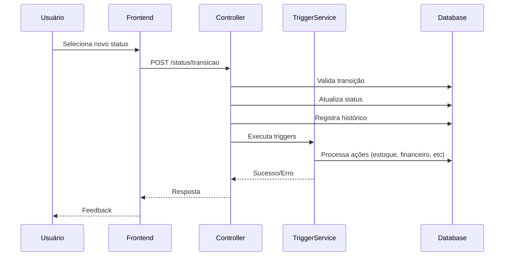

# Guia de Implementação de Triggers - Módulo Movimento

## 📋 Visão Geral

Os **triggers** são ações automáticas executadas durante as transições de status dos movimentos. Eles permitem automatizar processos como entrada/saída de estoque, geração de parcelas financeiras, emissão de notas fiscais, etc.

---

## 🏗️ Arquitetura

### **Estrutura de Arquivos**

```
server/src/services/movimento/
├── MovimentoStatusTriggerService.ts    # Gerenciador de triggers
└── triggers/
    ├── entradaTriggers.ts              # Triggers de entrada
    ├── saidaTriggers.ts                # Triggers de saída
    └── index.ts                        # Registro de triggers
```

### **Fluxo de Execução**



---

## 🎯 Triggers Disponíveis

### **Triggers de ENTRADA**

| Trigger | Descrição | Quando Usar |
|---------|-----------|-------------|
| `validarDadosFiscais` | Valida dados obrigatórios antes de finalizar | Antes de finalizar entrada |
| `darEntradaEstoque` | Incrementa saldo do estoque | Ao finalizar entrada |
| `atualizarValoresProdutos` | Atualiza custos e valores dos produtos | Após entrada no estoque |
| `gerarContasPagar` | Cria parcelas no financeiro (CP) | Ao finalizar entrada |

### **Triggers de SAÍDA**

| Trigger | Descrição | Quando Usar |
|---------|-----------|-------------|
| `reservarEstoque` | Reserva quantidade no estoque | Ao confirmar pedido |
| `baixarEstoque` | Baixa quantidade do estoque | Ao faturar/finalizar |
| `gerarParcelasFinanceiras` | Cria parcelas no financeiro (CR) | Ao faturar |
| `emitirNotaFiscal` | Emite NF-e e envia para SEFAZ | Ao faturar |
| `cancelarReservaEstoque` | Libera reservas de estoque | Ao cancelar pedido |

---

## 🔧 Como Configurar Triggers

### **1. Configurar na Transição (Banco de Dados)**

Os triggers são configurados no campo `postActions` da tabela `mov_status_transicao`:

```json
{
  "postActions": [
    {
      "type": "trigger",
      "triggerName": "darEntradaEstoque",
      "ordem": 1
    },
    {
      "type": "trigger",
      "triggerName": "atualizarValoresProdutos",
      "ordem": 2
    }
  ]
}
```

### **2. Exemplo de Fluxo de Entrada**

**Status:** Cadastrado → Finalizado

```sql
-- Configurar transição com triggers
UPDATE mov_status_transicao
SET post_actions = '[
  {
    "type": "trigger",
    "triggerName": "validarDadosFiscais",
    "ordem": 1
  },
  {
    "type": "trigger",
    "triggerName": "darEntradaEstoque",
    "ordem": 2
  },
  {
    "type": "trigger",
    "triggerName": "atualizarValoresProdutos",
    "ordem": 3
  },
  {
    "type": "trigger",
    "triggerName": "gerarContasPagar",
    "ordem": 4
  }
]'::jsonb
WHERE status_origem_id = 1 -- Cadastrado
  AND status_destino_id = 5 -- Finalizado
  AND empresa_id = 1;
```

### **3. Exemplo de Fluxo de Saída**

**Status:** Orçamento → Confirmado → Faturado → Expedido

```sql
-- Transição: Orçamento → Confirmado (Reservar estoque)
UPDATE mov_status_transicao
SET post_actions = '[
  {
    "type": "trigger",
    "triggerName": "reservarEstoque",
    "ordem": 1
  }
]'::jsonb
WHERE status_origem_id = 10 -- Orçamento
  AND status_destino_id = 11 -- Confirmado
  AND empresa_id = 1;

-- Transição: Confirmado → Faturado (Baixar estoque + Gerar parcelas + Emitir NF)
UPDATE mov_status_transicao
SET post_actions = '[
  {
    "type": "trigger",
    "triggerName": "baixarEstoque",
    "ordem": 1
  },
  {
    "type": "trigger",
    "triggerName": "gerarParcelasFinanceiras",
    "ordem": 2
  },
  {
    "type": "trigger",
    "triggerName": "emitirNotaFiscal",
    "ordem": 3
  }
]'::jsonb
WHERE status_origem_id = 11 -- Confirmado
  AND status_destino_id = 12 -- Faturado
  AND empresa_id = 1;

-- Transição: Confirmado → Cancelado (Liberar reserva)
UPDATE mov_status_transicao
SET post_actions = '[
  {
    "type": "trigger",
    "triggerName": "cancelarReservaEstoque",
    "ordem": 1
  }
]'::jsonb
WHERE status_origem_id = 11 -- Confirmado
  AND status_destino_id = 99 -- Cancelado
  AND empresa_id = 1;
```

---

## 🚀 Inicialização no Servidor

Os triggers devem ser registrados na inicialização do servidor:

```typescript
// server/src/index.ts ou server.ts

import { registerMovimentoTriggers } from './services/movimento/triggers';

// Registrar triggers na inicialização
registerMovimentoTriggers();

console.log('✅ Triggers de movimento registrados');
```

---

## 📝 Como Criar Novos Triggers

### **1. Criar a Função do Trigger**

```typescript
// server/src/services/movimento/triggers/customTriggers.ts

import { Transaction } from 'sequelize';
import { MovMovimento } from '../../../database/models/movimento/movMovimento';

export const meuNovoTrigger = async (
  movimento: MovMovimento,
  fromStatusId: number,
  toStatusId: number,
  categoria: 'OPERACIONAL' | 'FINANCEIRO',
  transaction: Transaction
): Promise<void> => {
  console.log(`Executando meu novo trigger para movimento ${movimento.movimentoId}`);
  
  // Sua lógica aqui
  // - Validações
  // - Atualizações no banco
  // - Integrações externas
  // - etc.
  
  console.log(`Trigger concluído com sucesso`);
};
```

### **2. Registrar o Trigger**

```typescript
// server/src/services/movimento/triggers/index.ts

import { meuNovoTrigger } from './customTriggers';

export function registerMovimentoTriggers(): void {
  // ... outros triggers
  
  MovimentoStatusTriggerService.registerTriggerFunction(
    'meuNovoTrigger',
    meuNovoTrigger
  );
}
```

### **3. Configurar na Transição**

```sql
UPDATE mov_status_transicao
SET post_actions = '[
  {
    "type": "trigger",
    "triggerName": "meuNovoTrigger",
    "ordem": 1
  }
]'::jsonb
WHERE ...;
```

---

## ⚠️ Boas Práticas

### **1. Transações**
- ✅ **Sempre use a transaction fornecida**
- ✅ Triggers são executados dentro da transação da mudança de status
- ✅ Se um trigger falhar, toda a transação é revertida

### **2. Validações**
- ✅ Valide dados obrigatórios antes de processar
- ✅ Lance exceções claras com mensagens descritivas
- ✅ Use triggers de validação antes de triggers de processamento

### **3. Logs**
- ✅ Registre início e fim de cada trigger
- ✅ Registre operações importantes (estoque, financeiro)
- ✅ Use console.log para debug e monitoramento

### **4. Ordem de Execução**
- ✅ Defina ordem lógica nos postActions
- ✅ Validações primeiro, processamentos depois
- ✅ Operações dependentes em sequência

### **5. Idempotência**
- ✅ Verifique se a operação já foi executada
- ✅ Evite duplicação de registros
- ✅ Use flags de controle quando necessário

---

## 🔍 Exemplo Completo: Fluxo de Venda

### **Pipeline de Saída**

```
ORÇAMENTO → CONFIRMADO → FATURADO → EXPEDIDO → CONCLUÍDO
```

### **Configuração das Transições**

```sql
-- 1. ORÇAMENTO → CONFIRMADO
-- Ação: Reservar estoque
UPDATE mov_status_transicao
SET post_actions = '[
  {
    "type": "trigger",
    "triggerName": "reservarEstoque",
    "ordem": 1
  }
]'::jsonb
WHERE status_origem_id = 10 AND status_destino_id = 11;

-- 2. CONFIRMADO → FATURADO
-- Ação: Baixar estoque + Gerar parcelas + Emitir NF
UPDATE mov_status_transicao
SET post_actions = '[
  {
    "type": "trigger",
    "triggerName": "baixarEstoque",
    "ordem": 1
  },
  {
    "type": "trigger",
    "triggerName": "gerarParcelasFinanceiras",
    "ordem": 2
  },
  {
    "type": "trigger",
    "triggerName": "emitirNotaFiscal",
    "ordem": 3
  }
]'::jsonb
WHERE status_origem_id = 11 AND status_destino_id = 12;

-- 3. FATURADO → EXPEDIDO
-- Ação: Integrar com transportadora
UPDATE mov_status_transicao
SET post_actions = '[]'::jsonb
WHERE status_origem_id = 12 AND status_destino_id = 13;

-- 4. EXPEDIDO → CONCLUÍDO
-- Ação: Finalizar processo
UPDATE mov_status_transicao
SET post_actions = '[]'::jsonb
WHERE status_origem_id = 13 AND status_destino_id = 14;

-- 5. CONFIRMADO → CANCELADO
-- Ação: Liberar reserva
UPDATE mov_status_transicao
SET post_actions = '[
  {
    "type": "trigger",
    "triggerName": "cancelarReservaEstoque",
    "ordem": 1
  }
]'::jsonb
WHERE status_origem_id = 11 AND status_destino_id = 99;
```

---

## 🐛 Troubleshooting

### **Trigger não está executando**
1. Verifique se o trigger está registrado: `MovimentoStatusTriggerService.getRegisteredTriggers()`
2. Verifique se o `postActions` está configurado corretamente na transição
3. Verifique os logs do console para mensagens de erro

### **Erro durante execução do trigger**
1. A transação será revertida automaticamente
2. Verifique a mensagem de erro retornada
3. Corrija o problema e tente novamente

### **Trigger executando múltiplas vezes**
1. Adicione verificação de idempotência
2. Use flags de controle no movimento
3. Verifique se não há duplicação de configuração

---

## 📚 Referências

- Documentação: `/docs/movimento-entrada-saida.md`
- Documentação: `/docs/agenda-transicoes-contexto.md`
- Código fonte: `/server/src/services/movimento/triggers/`
- Controller: `/server/src/controller/movimento/MovimentoStatusController.ts`

---

**Última atualização:** 2026-01-18
